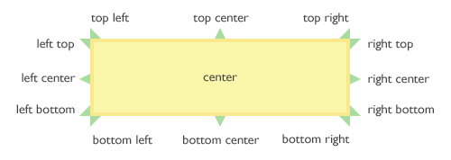

---

title: "Hints"
sidebarDepth: 1

---

# Using the `hints` Argument

Hints may be used within [fields](../objects/field.md), displaying a small question mark icon after (or before) the field title.

<span style="display:block;text-align:center"></span>

See the little question mark icon above? When a user moves their mouse over the icon (or clicks in, optionally), a tooltip will display with additional information you provide. How do it all work? Please continue reading.

::: warning Table of Contents
[[toc]]
:::

## A little housework
There are some settings you must specify in the `setArguments` section of the `sample-config.php` file (or whatever you have chosen to name your config file). The `hints` array. Should these not be specified, Redux will use the default settings (explain below). The hints array contains several settings, and a few setting arrays so that the hints feature may be customized as desired. Each will be explained as we go.

Here is what the default settings inside your global arguments array would look like:

```php
$this->args = array(
    // ... (list of other arguments in the args array)

    // HINTS
    'hints' = array(
        'icon'              => 'el icon-question-sign',
        'icon_position'     => 'right',
        'icon_color'        => 'lightgray',
        'icon_size'         => 'normal',
        'tip_style'         => array(
            'color'     => 'light',
            'shadow'    => true,
            'rounded'   => false,
            'style'     => '',
        ),
        'tip_position'      => array(
            'my' => 'top left',
            'at' => 'bottom left',
        ),
        'tip_effect' => array(
            'show' => array(
                'effect'    => 'slide',
                'duration'  => '500',
                'event'     => 'mouseover',
            ),
            'hide' => array(
                'effect'    => 'slide',
                'duration'  => '500',
                'event'     => 'click mouseleave',
            ),
        ),
    ),
);
```

I know that code must seem a little intimidating, but really, it is not. We'll start at the top.

::: danger
These settings are **global**, which means they will apply to all tool-tips on any given panel.
:::

## Arguments

|Name|Type|Default|Description|
|--- |--- |--- |--- |
|icon|string|`el icon-question-sign`|The icon from the Elusive Icon pack that represents the object where the tool-tip will appear, This happens when the user mouses over (or clicks, if set) the icon.|
|icon_position|string|`right`|Choose between `right` or `left.` The hint icon will appear either to the left of the field title, or to the far right.|
|icon_color|hex string|`lightgray`|This argument sets the color of the hint icon.|
|icon_size|string|`normal`|Choose between `normal` (16px) or `large` (18px). There are the only two sizes that work well with the feature. Anything else is too small or too big.|
|tip_style|Array|An array containing the color, shadow, rounded and style properties for the tool-tip. See the Tool-tip Style options below.|
|tip_position|Array|An array containing the `my` and `at` options, which determines in the placement of the tool-tip in relation to the hint icon. See the Tool-tip Positioning section below.|
|tip_effect|Array|An array containing the `show` and `hide` arrays. Both arrays contain the tool-tip effect properties. These include `effect`, `duration`, and `event` for both ``and`show`. See the Tool-tip Effects Options below.|


## Tool-tip Styling Options
|Name|Type|Default|Description|
|--- |--- |--- |--- |
|color|string|`light`|This argument accepts the following colors: `cream` (default), `light`, `dark`, `red`, `green`, `blue` <br /> |
|shadow|bool|`false`|When set, this flag determines if a shadow will appear behind the tool-tip.|
|rounded|bool|`false`|When set, this flag determines if the corners of the tool-tip will be rounded.|
|style|string||The argument accepts the following styles, which determines the style in which the tool-tip will be displayed: `youtube`, `tipsy`, `bootstrap`, `tipped`, `jtools`, and `cluetip` (not shown)<br /> |


## Tool-tip Position Options
|Name|Type|Default|Description|
|--- |--- |--- |--- |
|my|string|`top left`|The area on the tool-tip in which the tip arrow (that points to the hint icon) will appear. See NOTES below.|
|at|string|`bottom right`|The area on the tool-tip target in which the tool-tip will appear. See NOTES below.|

::: tip
With the exception of the value `center`, the values must be passed with a horizontal value on the left (top, center, or bottom), and a vertical value on the right (left, center, right). Any other incorrect or misspelled combination of values will force Redux to use the default value. See the diagram below:<br />
<span style="display:block;text-align:center"></span>
:::

## Tool-tip Effect Options
|Name|Type|Default|Description|
|--- |--- |--- |--- |
|show|array|The array which holds the `effect`, `duration`, and `event` properties for displaying the tool-tip. See below|
|hide|array|The array which holds the `effect`, `duration`, and `event` properties for dismissing the tool-tip. See below.|

## Show and Hide Effects
|Name|Type|Default|Description|
|--- |--- |--- |--- |
|effect|string|slide|Choose between `''` (a blank string), `slide`, and `fade`|
|duration|int|500|The number of microseconds (1 second = 1000) used for the effect to take place.|
|event|string|show: mouseover, hide: unfocus mouseleave|A single or combination of events that defines the behavior in which the tool-tip will appear. Generally, for the `show` event, one might use `mouseover` or `click`. For the `hide` event, any combination of of `click`, `mouseleave` and/or `unfocus`. The unfocus flag is used so the user may click anywhere on the screen to dismiss the tool-tip.|

## Using Hints with Fields
Once the Hint arguments are set, adding hints to your [fields](../objects/field.md) array is as easy as adding 
the following argument to your field array.

```php
array(
    'hint' => array(
        'title'   => 'Hint Title',
        'content' => 'This is the content of the tool-tip'
    )
)
```

The argument *must* be an array, but adding a `title` is optional. The `content` argument accepts HTML styling. The 
inclusion of the hint argument instructs Redux to automatically generate the hint icon. There is no need to set any 
other argument.

### Using Hints with Text Boxes
In addition to using hints to add additional information to the [field](../objects/field.md) itself, hints may also be used to popup a tool-tip 
when a user clicks on a text box. Enabling this feature is also as easy as adding a single array based argument to the 
text field.

```php
array(
    'text_hint' => array(
        'title'   => 'Hint Title',
        'content' => 'Hint content about this field!',
    )
)
```

Adding this argument to the text field will display a tool-tip when the text [field](../objects/field.md) is selected. 
As with the hints feature, the title is optional and HTML is accepted in the content argument.