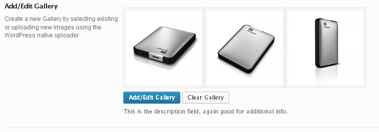

# Gallery

With the Gallery field, create a new gallery of images by selecting existing images or uploading new ones with the WordPress uploader.

<span style="display:block;text-align:center"></span>

::: warning Table of Contents
[[toc]]
:::

## Arguments
|Name|Type|Default|Description|
|--- |--- |--- |--- |
|type|string|`gallery`|Value identifying the field type.|

::: tip Also See
- [Global Field Arguments](../configuration/fields/arguments.md)
- [Using the `compiler` Argument](../configuration/fields/compiler.md)
- [Using the `permissions` Argument](../configuration/fields/permissions.md)
- [Using the `required` Argument](../configuration/fields/required.md)
:::


## Example Declaration
<script>
import builder from './gallery.json';
export default {
    data () {
        return {
            builder: builder,
            defaults: {}
        };
    }
}
</script>
<builder :builder_json="builder" :builder_defaults="defaults" />

## Example Declaration
```php
Redux::addField( 'OPT_NAME', 'SECTION_ID', array(
    'id'       => 'opt-gallery',
    'type'     => 'gallery',
    'title'    => __('Add/Edit Gallery', 'redux-framework-demo'),
    'subtitle' => __('Create a new Gallery by selecting existing or uploading new images using the WordPress native uploader', 'redux-framework-demo'),
    'desc'     => __('This is the description field, again good for additional info.', 'redux-framework-demo'),
) );
```
## Example Usage
This example in based on the example usage provided above. Be sure to change `$redux_demo` to the value you specified in your [opt_name](../configuration/global_arguments.md#opt_name) argument.

The gallery field returns a comma separated value of the attachment IDs of the selected images.
```php
global $redux_demo;

echo '' . $redux_demo['opt-gallery'];
```
