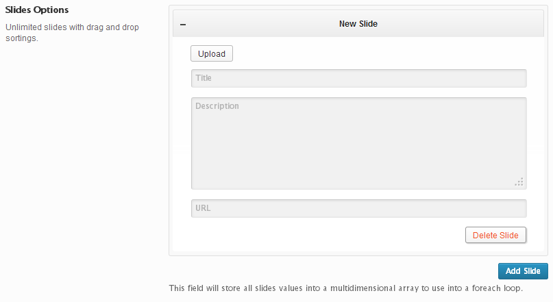

# Slides
With the Slider field, unlimited slides may be created with titles, descriptions and links.

<span style="display:block;text-align:center"></span>

::: warning Table of Contents
[[toc]]
:::

## Arguments
|Name|Type|Default|Description|
|--- |--- |--- |--- |
|type|string|`slides`|Value identifying the field type.|
|id|string||Unique ID identifying the field. Must be different from all other field IDs.|
|title|string||Displays title of the option.|
|subtitle|string||Subtitle display of the option, situated beneath the title.|
|desc|string||Description of the option, appearing beneath the field control.|
|class|string||Appends any number of classes to the field's class attribute.|
|compiler|bool||Flag to run the compiler hook.  More info|
|required|array||Provide the parent, comparison operator, and value which affects the field's visibility.  More info|
|placeholder|array||Array of placeholder values.  See 'Placeholder Values' below.|
|permissions|string||String specifying the capability required to view the section.   More info.|
|hint|array||Array containing the `content` and optional `title` arguments for the hint tooltip.  More info|

::: tip Also See
- [Using the `compiler` Argument](../configuration/argument/compiler.md)
- [Using the `hints` Argument](../configuration/argument/hints.md)
- [Using the `permissions` Argument](../configuration/argument/permissions.md)
- [Using the `required` Argument](../configuration/argument/required.md)
:::

## Placeholder Values
|Name|Type|Description|
|--- |--- |--- |
|title|string|Placeholder for the title field.|
|description|string|Placeholder for the description field.|
|sort|string|Sort number for the slide order.|
|url|string|Placeholder for the URL field.|
|image|string|Placeholder for the image text field.|
|thumb|string|Placeholder for the image select field.|
|attachment_id|string|Placeholder image in URL format.|
|height|string|Placeholder height for the preview image.|
|width|string|Placeholder width for the preview image.|

## Example Declaration

```php
Redux::addField( 'OPT_NAME', 'SECTION_ID', array(
    'id'          => 'opt-slides',
    'type'        => 'slides',
    'title'       => __('Slides Options', 'redux-framework-demo'),
    'subtitle'    => __('Unlimited slides with drag and drop sortings.', 'redux-framework-demo'),
    'desc'        => __('This field will store all slides values into a multidimensional array to use into a foreach loop.', 'redux-framework-demo')
    'placeholder' => array(
        'title'       => __('This is a title', 'redux-framework-demo'),
        'description' => __('Description Here', 'redux-framework-demo'),
        'url'         => __('Give us a link!', 'redux-framework-demo'),
    ),
) );
```

## Example Usage
This example assumes at least one slide has been filled out and saved, based on the example usage provided above. Individual slide information are stored in a zero-based array. Be sure to change `$redux_demo` to the value you specified in your <a title="opt_name" href="/redux-framework/arguments/opt_name/">`opt_name` argument.</a>

::: warning IMPORTANT NOTE
Redux does NOT save blank slides to the database.  This means on the initial load of your options panel, the empty slide will not be available.  It will be necessary to use `isset` and `!empty` checks on the slide variable before attempting to use it in your code, as shown below.
:::

```php
global $redux_demo;

if ( isset( $redux_demo['opt-slides'] ) && !empty( $redux_demo['opt-slides'] ) ) {
    echo 'Slide 1 Title: '         . $redux_demo['opt-slides'][0]['title'];
    echo 'Slide 1 Description: '   . $redux_demo['opt-slides'][0]['description'];
    echo 'Slide 1 URL: '           . $redux_demo['opt-slides'][0]['url'];
    echo 'Slide 1 Attachment ID: ' . $redux_demo['opt-slides'][0]['attachment_id'];
    echo 'Slide 1 Thumb: '         . $redux_demo['opt-slides'][0]['thumb'];
    echo 'Slide 1 Image: '         . $redux_demo['opt-slides'][0]['image'];
    echo 'Slide 1 Width: '         . $redux_demo['opt-slides'][0]['width'];
    echo 'Slide 1 Height: '        . $redux_demo['opt-slides'][0]['height'];
}
```

