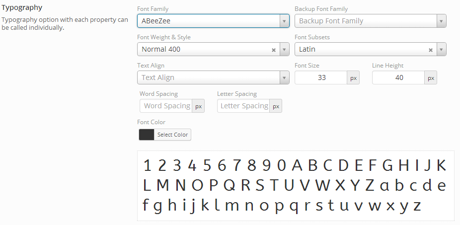

# Typography

The Redux Typography field in second-to-none when it comes to other options out there.  It's often copied in concept,
but limited in functionality. Google fonts, font preview, color-picket, letter &amp; word spacing, styles &amp; weight 
selection, and much, much more!

<span style="display:block;text-align:center"></span>

::: warning Table of Contents
[[toc]]
:::

## Arguments
|Name|Type|<div style="width:100px;">Default</div>|Description|
|--- |--- |--- |--- |
|type|string|`typography`|Value identifying the field type.|
|default|array||See [Default Argument](#default-argument) below.|
|units|string|px|Sets the default unit value.  Accepts: `px` `em` `rem` `%`|
|google|bool|`true`|Flag to set Google fonts. Please make sure the Google API key is defined, or this feature will not work. For information on acquiring an API key, go to [Google Developer](https://developers.google.com/fonts/docs/developer_api#Auth)|
|fonts|array||An array of fonts in key pair format. Specifying a font array will override the default "standard" fonts.|
|font-backup|bool|`false`|Flag to display a selector specifying backup non-Google fonts when Google fonts are used.|
|font-style|bool|`true`|Flag to display the font style selector.|
|font-weight|bool|`true`|Flag to display the font weight selector.|
|font-size|bool|`true`|Flag to display the font size input.|
|font-family|bool|`true`|Flag to display the font family selector.|
|subsets|bool|`true`|Subsets only appear if `google` is set to true and `subsets` is set to true.|
|line-height|bool|`true`|Flag to display the font line height input.|
|word-spacing|bool|`false`|Flag to display the word spacing input.|
|letter-spacing|bool|`false`|Flag to display the letter spacing input.|
|text-align|bool|`true`|Flag to display the text alignment selector.|
|text-transform|bool|`false`|Flag to display the text transform selector.|
|color|bool|`true`|Flag to display the font color input.|
|preview|array||Array value for preview settings.  See 'Preview Options' below.|
|all_styles|bool|`false`|Flag to set all available styles for selected Google font in the CSS.|
|select2|array||Array of select2 arguments. [Select2 Documentation](https://select2.org/configuration/options-api).|
|font_family_clear|bool|`true`|Flag to set the clear field button on the font-family selector.|

::: tip Also See
- [Global Field Arguments](../configuration/fields/arguments.md)
- [Using the `compiler` Argument](../configuration/fields/compiler.md)
- [Using the `output` Argument](../configuration/fields/output.md)
- [Using the `output_variables` Argument](../configuration/fields/output-variables.md)
- [Using the `permissions` Argument](../configuration/fields/permissions.md)
- [Using the `required` Argument](../configuration/fields/required.md)
:::

## Default Argument
|Name|Type|Description|
|--- |--- |--- |
|font-backup|bool|Flag to select a backup non-Google font in addition to a Google font.|
|font-style|string|Sets the default font style.|
|font-weight|string|Sets the default font weight.|
|font-size|string|Sets the default font size.|
|font-family|string|Sets the default font family.|
|line-height|string|Sets the default line height.|
|word-spacing|string|Sets the default word spacing.|
|letter-spacing|string|Sets the default letter spacing.|
|google|bool|Flag to set Google fonts.|
|color|string|Hex string to set the color picker default.|
|text-align|string|Sets the default text align value.  Accepts:  `inherit`, `left`, `right`, `center`, `justify`, or `initial`.|
|text-transform|string|Sets the default text transform value.  Accepts:  `none`, `capitalize`, `uppercase`, `lowercase`, `initial`, or `inherit`.|

## Preview Options
|Name|Type / Default Value|Description|
|--- |--- |--- |
|text|alphanumeric string|Text to display in the font preview area.|
|font-size|33px|Value to set the font size in the preview area.|
|always_display|`false`|Flag that sets whether or not the font preview will display, even when no changes are made.|


## Example Declaration
<script>
import builder from './typography.json';
export default {
    data () {
        return {
            builder: builder,
            defaults: {}
        };
    }
}
</script>
<builder :builder_json="builder" :builder_defaults="defaults" />

## Example Declaration

```php
Redux::setField( 'OPT_NAME', 'SECTION_ID', array( 
    'id'          => 'opt-typography',
    'type'        => 'typography', 
    'title'       => __('Typography', 'redux-framework-demo'),
    'google'      => true, 
    'font-backup' => true,
    'output'      => array('h2.site-description'),
    'units'       =>'px',
    'subtitle'    => __('Typography option with each property can be called individually.', 'redux-framework-demo'),
    'default'     => array(
        'color'       => '#333', 
        'font-style'  => '700', 
        'font-family' => 'Abel', 
        'google'      => true,
        'font-size'   => '33px', 
        'line-height' => '40'
    ),
) );
```

## Example Usage
This example in based on the example usage provided above. Be sure to change `$redux_demo` to the value you specified in your [opt_name](../configuration/global_arguments.md#opt_name) argument.

```php
global $redux_demo;

echo 'Color: '       . $redux_demo['opt-typography']['color'];
echo 'Font style: '  . $redux_demo['opt-typography']['font-style'];
echo 'Font family: ' . $redux_demo['opt-typography']['font-family'];
echo 'Google: '      . $redux_demo['opt-typography']['google'];
echo 'Font size: '   . $redux_demo['opt-typography']['font-size'];
echo 'Line height: ' . $redux_demo['opt-typography']['line-height'];
```

